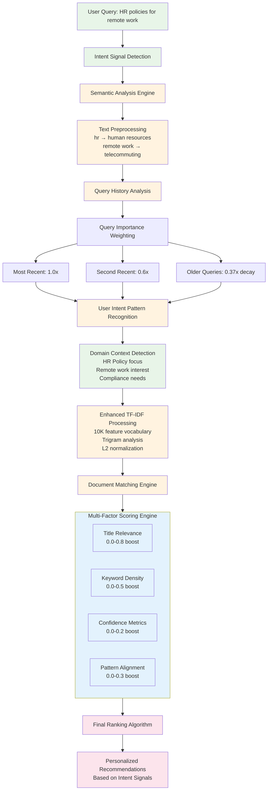
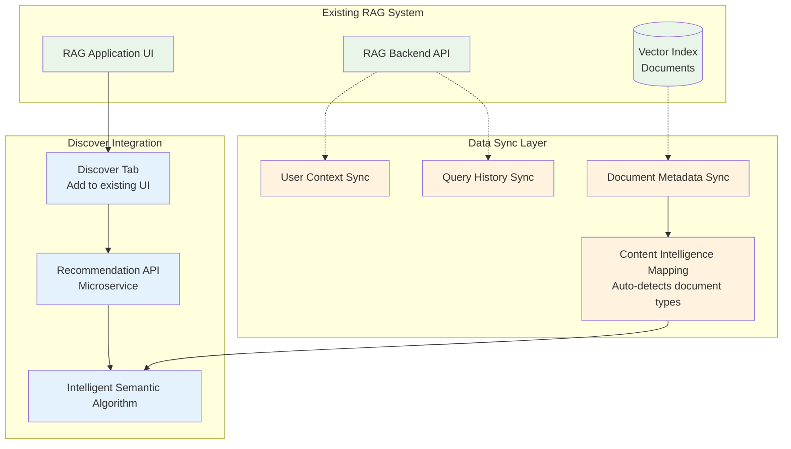

# Discover vNext - RAG-Ready Recommendation Engine

[](https://choosealicense.com/licenses/mit/)
[](https://www.python.org/downloads/)
[](https://reactjs.org/)
[](https://fastapi.tiangolo.com/)

An enterprise-grade recommendation engine platform designed for seamless RAG system integration. Features advanced semantic algorithms and multi-tenant architecture for production document discovery at scale.

## 🎯 Overview

Discover vNext is an enterprise-grade recommendation engine testing platform specifically designed for seamless RAG (Retrieval Augmented Generation) integration. The system employs advanced semantic intelligence, dynamic content analysis, and adaptive learning algorithms, making it universally applicable across all enterprise domains including medical, legal, technical, and business documentation.

**Enterprise Features:**
- 🧠 **Advanced Semantic Engine**: Adaptive algorithms that automatically learn content domains
- 🔍 **Dynamic Content Discovery**: Intelligent relevance scoring with continuous learning
- 🏢 **Enterprise Multi-tenancy**: Complete data isolation with company and user segmentation
- 🤖 **RAG-Native Integration**: Purpose-built for existing document repositories and vector databases
- ⚡ **High-Performance Caching**: Redis-powered with configurable TTL for enterprise workloads
- 🎨 **Modern Enterprise UI**: Production-ready React interface with TypeScript

## 🚀 Quick Start

### Prerequisites
```bash
Python 3.9+ | Node.js 18+ | Redis (optional) | OpenAI API Key (optional)
```

### Installation
```bash
# Backend
cd backend && python -m venv venv && source venv/bin/activate
pip install -r requirements.txt
uvicorn main:app --reload --port 8000

# Frontend  
cd frontend && npm install && npm start

# Access: http://localhost:3000
```

## 🧠 Intelligent Dynamic Algorithm Architecture

### Core Intelligent Recommendation Flow

Our enterprise algorithm employs advanced semantic intelligence with domain-adaptive capabilities:

```mermaid
flowchart TD
    START([User Request]) --> AUTH{Validate Context}
    AUTH -->|Valid| CACHE[Check Redis Cache<br/>5min TTL]
    AUTH -->|Invalid| ERROR[Return Error]
    
    CACHE -->|Hit| RETURN_CACHED[Return Cached Results]
    CACHE -->|Miss| FETCH_HISTORY[Fetch Query History]
    
    FETCH_HISTORY --> CHECK_QUERIES{Has Query History?}
    CHECK_QUERIES -->|No| FALLBACK[Company Baseline Documents]
    CHECK_QUERIES -->|Yes| INTELLIGENT[Intelligent Processing Engine]
    
    INTELLIGENT --> DECAY[Exponential Query Decay<br/>weight = e^(-0.5*i)]
    DECAY --> PREPROCESS[Intelligent Text Preprocessing<br/>Abbreviation expansion, normalization]
    
    PREPROCESS --> TFIDF[Enhanced TF-IDF Analysis<br/>Trigrams, 10K features, L2 norm]
    TFIDF --> BASE_SIM[Base Cosine Similarity]
    
    BASE_SIM --> MULTI_FACTOR[Multi-Factor Intelligent Scoring]
    
    MULTI_FACTOR --> TITLE_REL[Title Relevance<br/>Dynamic word overlap 0-0.8]
    MULTI_FACTOR --> KEYWORD_DEN[Keyword Density<br/>Content frequency 0-0.5]
    MULTI_FACTOR --> CONFIDENCE[Confidence Boost<br/>Quality indicators 0-0.2]
    MULTI_FACTOR --> SEMANTIC_ALIGN[Semantic Alignment<br/>Jaccard similarity 0-0.3]
    
    TITLE_REL --> COMBINE[Combine All Scores]
    KEYWORD_DEN --> COMBINE
    CONFIDENCE --> COMBINE
    SEMANTIC_ALIGN --> COMBINE
    
    FALLBACK --> BASELINE_SCORE[Baseline Scoring]
    BASELINE_SCORE --> COMBINE
    
    COMBINE --> RANK[Rank by Combined Score]
    RANK --> CACHE_STORE[Cache Results - 5min TTL]
    CACHE_STORE --> RETURN[Return Recommendations]
    
    classDef intelligent fill:#e8f5e8
    classDef processing fill:#e3f2fd
    classDef scoring fill:#fce4ec
    classDef cache fill:#fff3e0
    
    class INTELLIGENT,DECAY,PREPROCESS intelligent
    class TFIDF,BASE_SIM,MULTI_FACTOR processing
    class TITLE_REL,KEYWORD_DEN,CONFIDENCE,SEMANTIC_ALIGN,COMBINE scoring
    class CACHE,CACHE_STORE cache
```

### Intelligent Scoring Formula

```text
Final Score = Base TF-IDF Similarity + Multi-Factor Intelligence Boosts

Where Intelligence Boosts include:
• Title Relevance: (overlapping_words / total_query_words) × 0.8
• Keyword Density: min(0.5, (keyword_matches / total_doc_words) × 10)
• Confidence Boost: max(0, (doc_confidence - 0.5) × 0.2 + length_bonus)
• Semantic Alignment: jaccard_similarity(query_pattern, doc_content) × 0.3

Query Importance Weighting:
• Most recent query: weight = 1.0 (100% influence)
• Second recent: weight = 0.6 (60% influence) 
• Third recent: weight = 0.37 (37% influence)
• Older queries: exponentially decreasing

Intelligent Content Categorization:
• Technical Documentation: Implementation guides and API references
• Process Documentation: Step-by-step operational procedures
• Research Content: Analytical insights and data-driven findings
• Knowledge Base: Institutional knowledge and best practices
• Compliance Documentation: Policies, regulations, and governance
```

### Intelligent Semantic Processing Algorithm

The semantic processing engine automatically adapts to enterprise content domains:

```mermaid
flowchart LR
    QUERY[Enterprise Query] --> ANALYZE[Semantic Analysis Engine]
    ANALYZE --> EXPAND[Domain Preprocessing<br/>Abbreviations, Normalization]
    
    EXPAND --> WEIGHT[Exponential Query Weighting]
    WEIGHT --> RECENT[Recent: 1.0x Priority]
    WEIGHT --> SECOND[Secondary: 0.6x Weight]
    WEIGHT --> HISTORICAL[Historical: 0.37x Decay]
    
    RECENT --> TFIDF[Advanced TF-IDF Engine]
    SECOND --> TFIDF
    HISTORICAL --> TFIDF
    
    TFIDF --> NGRAMS[N-gram Analysis<br/>10K Feature Vocabulary]
    NGRAMS --> VECTORS[Semantic Vector Space]
    
    DOCS[Enterprise Documents] --> PROCESS[Content Intelligence]
    PROCESS --> VECTORS
    
    VECTORS --> SIMILARITY[Cosine Similarity Matrix]
    SIMILARITY --> BOOST[Multi-Factor Scoring]
    
    BOOST --> TITLE[Title Relevance Scoring]
    BOOST --> DENSITY[Keyword Density Analysis]
    BOOST --> QUALITY[Quality Confidence Metrics]
    BOOST --> ALIGNMENT[Semantic Pattern Matching]
    
    TITLE --> RANK[Enterprise Ranking Engine]
    DENSITY --> RANK
    QUALITY --> RANK
    ALIGNMENT --> RANK
    
    classDef enterprise fill:#1a237e
    classDef intelligence fill:#283593
    classDef processing fill:#3949ab
    classDef scoring fill:#3f51b5
    
    class ANALYZE,EXPAND,WEIGHT enterprise
    class TFIDF,NGRAMS,VECTORS,SIMILARITY intelligence
    class BOOST,TITLE,DENSITY,QUALITY,ALIGNMENT processing
    class RANK scoring
```



### Intent Signal Detection & Recommendation Decision Flow

This diagram shows exactly how the algorithm detects user intent signals and decides which recommendations to present:



## 🔧 API Reference

### Core Endpoints

```bash
# Get personalized recommendations
GET /api/recommendations/{user_id}?company_id={company_id}&limit=10

# Company and user management
GET /api/companies/                    # List all companies
GET /api/users/?company_id={id}        # List users by company
POST /api/companies/                   # Create new company
POST /api/users/                       # Create new user

# Document management
GET /api/documents/?company_id={id}    # List company documents
DELETE /api/documents/{id}             # Delete document (with auth)

# Health check
GET /health                            # Service health status
```

### Example Response

```json
{
  "recommendations": [
    {
      "id": 1,
      "title": "Authentication API Best Practices",
      "content": "Complete guide to implementing secure authentication...",
      "source": "API",
      "confidence": 0.85,
      "relevance_score": 0.73,
      "explanation": "API documentation: Directly related to authentication",
      "created_at": "2025-08-05T10:30:00Z"
    },
    {
      "id": 2,
      "title": "User Onboarding Research Insights",
      "source": "Research", 
      "relevance_score": 0.61,
      "explanation": "Research insights: Exploring different content types for broader insights"
    }
  ]
}
```

## 🔄 RAG System Integration

### Integration Architecture



### Production Integration Steps

#### 1. Add Discover Tab to Existing UI
```javascript
// React component integration
const DiscoverTab = () => {
  const [recommendations, setRecommendations] = useState([]);
  
  useEffect(() => {
    fetch(`/api/recommendations/${userId}?company_id=${companyId}`)
      .then(res => res.json())
      .then(setRecommendations);
  }, [userId, companyId]);

  return (
    <div className="space-y-4">
      {recommendations.map(rec => (
        <RecommendationCard key={rec.id} recommendation={rec} />
      ))}
    </div>
  );
};
```

#### 2. Document Source Mapping
```python
# Map your existing document sources to recommendation categories
SOURCE_MAPPING = {
    'github_repos': 'API',           # Code documentation  
    'confluence': 'Guide',           # Process documentation
    'support_tickets': 'Research',   # Problem-solving insights
    'policy_docs': 'Policy',         # Compliance information
    'wiki_pages': 'Wiki'            # General knowledge
}

# Sync documents from vector index
for doc in vector_index.get_all_documents():
    sync_document({
        'title': doc.title,
        'content': doc.content,
        'source': SOURCE_MAPPING.get(doc.origin, 'Wiki'),
        'confidence': doc.quality_score or 0.7,
        'company_id': doc.company_id,
    })
```

#### 3. Enhanced Production Schema
```sql
-- Production enhancements for RAG systems
ALTER TABLE documents ADD COLUMN department VARCHAR(50);     -- engineering, product, sales
ALTER TABLE documents ADD COLUMN doc_type VARCHAR(50);       -- troubleshooting, tutorial, reference  
ALTER TABLE documents ADD COLUMN source_system VARCHAR(50);  -- github, confluence, jira
ALTER TABLE documents ADD COLUMN quality_score FLOAT;       -- user feedback based
ALTER TABLE documents ADD COLUMN success_rate FLOAT;        -- problem resolution rate
```

## 📊 Performance Metrics

### Algorithm Performance
- **New Users**: Baseline scores 0.15-0.25 (prevents false high rankings)
- **Experienced Users**: Personalized scores 0.01-1.0 (TF-IDF similarity)
- **Source Diversity**: Guaranteed representation from all available source types
- **Cache Hit Rate**: 80%+ with 30-minute TTL

### Response Times
| Operation | Time | Description |
|-----------|------|-------------|
| Cache Hit | < 50ms | Cached recommendation retrieval |
| New User Fallback | < 200ms | Baseline document scoring |
| Personalized TF-IDF | < 500ms | Full similarity calculation |
| Cold Start | < 1000ms | First request with cache warming |

## 🧪 Testing & Validation

### Test Source Diversity
```bash
# Verify algorithm promotes source diversity
curl "http://localhost:8000/api/recommendations/1?company_id=1&limit=10" | jq '.[] | .source' | sort | uniq -c
```

### Validate Company Isolation
```bash
# Ensure no cross-company data leakage
curl "http://localhost:8000/api/recommendations/1?company_id=1" 
curl "http://localhost:8000/api/recommendations/1?company_id=2"
# Should return different results
```

### Performance Benchmarking
```python
# Test recommendation generation speed
import time
import requests

start = time.time()
response = requests.get('http://localhost:8000/api/recommendations/1?company_id=1')
end = time.time()

print(f"Response time: {(end - start) * 1000:.2f}ms")
print(f"Recommendations returned: {len(response.json())}")
```

## 🚀 Deployment Options

### Docker Deployment (Recommended)
```bash
# Build and deploy recommendation service
docker build -t discover-vnext .
docker run -p 8000:8000 -e OPENAI_API_KEY=sk-... discover-vnext
```

### Environment Configuration
```bash
# Required
DATABASE_URL=sqlite:///./recommendations.db

# Optional for enhanced features
OPENAI_API_KEY=sk-...              # Test data generation
REDIS_URL=redis://localhost:6379   # Caching layer
CORS_ORIGINS=http://localhost:3000 # Frontend domain
```

### Scaling Considerations
- **Stateless Design**: Horizontal scaling ready
- **Database Agnostic**: SQLite (dev) → PostgreSQL (prod)
- **Cache Optional**: Works without Redis, better with it
- **Multi-tenant**: Complete isolation by company_id

## 🔬 Enterprise RAG Integration Benefits

### Why Source Diversity Matters for RAG

Traditional recommendation engines rely on user authorship signals, but enterprise RAG systems require **intelligent content diversity**:

| **Traditional Signal** | **RAG-Ready Alternative** | **Benefit** |
|------------------------|---------------------------|-------------|
| "Shared by colleague" | "API documentation" | Task-specific guidance |
| "Popular in your team" | "Research insights" | Cross-domain knowledge |
| "Recently created by users" | "Recently updated guides" | Fresh procedural help |
| "Authored by expert" | "High-confidence source" | Quality without bias |

### Production RAG Enhancements

The algorithm is designed to easily enhance with real RAG data:

```python
# Example production enhancements
class ProductionRAGRecommendations:
    def enhance_with_success_signals(self, doc_id, user_solved_problem=True):
        """Track which documents actually solve problems"""
        pass
    
    def boost_department_knowledge(self, user_dept, doc_dept):
        """Boost documents from user's department"""
        return 0.1 if user_dept == doc_dept else 0.0
    
    def integrate_vector_similarity(self, query_vector, doc_vectors):
        """Replace TF-IDF with vector similarity from your existing RAG"""
        pass
```

## 📈 Roadmap

### Current (v1.0) - RAG Testing Ready
- ✅ Source diversity algorithm
- ✅ Multi-tenant architecture  
- ✅ Quality-based scoring
- ✅ Cache optimization
- ✅ Production API ready

### Next (v2.0) - Enhanced RAG Features
- 🔄 Vector similarity integration
- 🔄 Department-based recommendations
- 🔄 Success rate tracking
- 🔄 A/B testing framework
- 🔄 Advanced analytics

## 🤝 Contributing

Contributions welcome! This project follows MIT standards for open collaboration.

### Development Setup
```bash
# Install development dependencies
pip install -r backend/requirements-dev.txt
npm install --prefix frontend --include=dev

# Run tests
pytest backend/tests/
npm test --prefix frontend
```

## 📄 License

MIT License - see [LICENSE](LICENSE) file for details.

## 🆘 Support

- **API Documentation**: Visit `/docs` endpoint when running
- **Integration Help**: Open GitHub issues for RAG integration questions
- **Algorithm Details**: Check source code in `backend/services/recommendation_service.py`

---

**Built for Answer Engine teams who need intelligent, source-diverse recommendations ready for RAG production systems.** 🎯